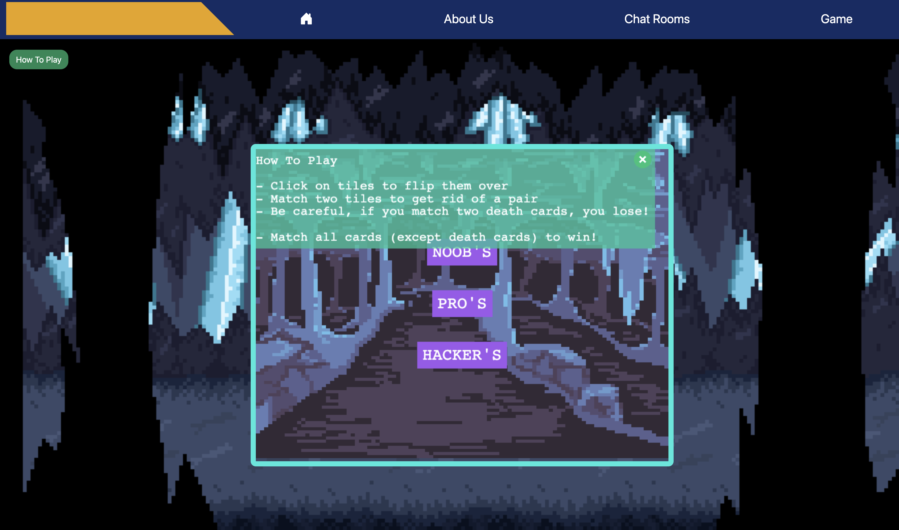

#Team 9

## Connecting to the VM without VPN:

1) $ ssh username@portkey.socs.uoguelph.ca
2) $ ssh socs@cis4250w24-09.socs.uoguelph.ca
3) password: EncoringSharePurplest

## Project git folder
	$ cd team_9

## Nginx website config folder
	$ cd /etc/nginx/sites-available

## How to run locally

1) Clone gitlab repo
2) cd into team_9 directory
3) Pull recent updates and cd into next-js directory
4) run 'npm i' then 'npm run dev'
5) Click link to localhost port to see changes

## Team Members:
	- Muhammad Salmaan 
	- Karina Garmendez (Team Lead)
	- Egor Ivanov
	- Cavaari Taylor
	- Tehreem Nazar
	- Eric Dearing 
	- Kalindu Kehel Baddarage 

	
## Sprint 4: Game Development

In Sprint 4: The inital stages of game development have been completed and basic game functionality is fully functional. The implementation begn by following our inital figma design from sprint 2 which included 3 game levels for our card matching game. In this sprint our focus was only implementing the middle (Pro) level of the game and focused on a single player perspective stand point. Our multiplayer functionality will be implemented in a later sprint to allow for multiple users from different device to conect to the same game room and play one on one.Once a game is created a room code is generated which will be used later for players to join the same room and play against one another. Our game UI and design is displayed below.

### Card Levels!!!
With the card matching algorithm and ui being completed, additional levels ahve been added to the game. These are the noob's, pro's and hacker's each with different amount of cards and death cards.

### Additional changes

Additionaly we added a screen modal for how to play the game on the top left side. Click it, to open the model and click on the 'x' to close it.

